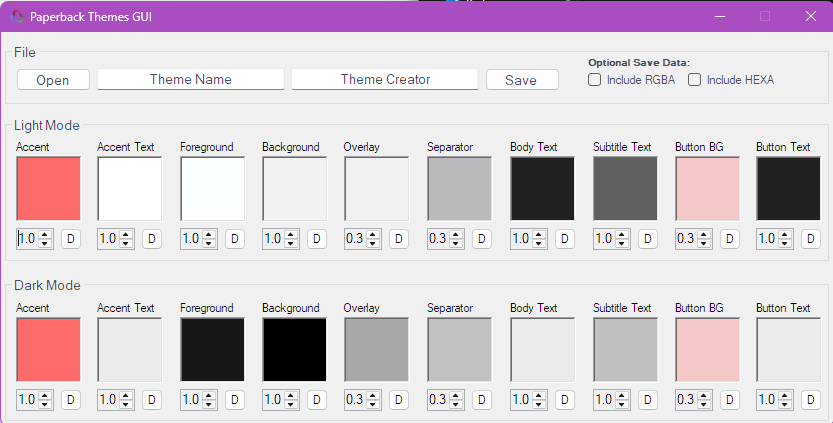
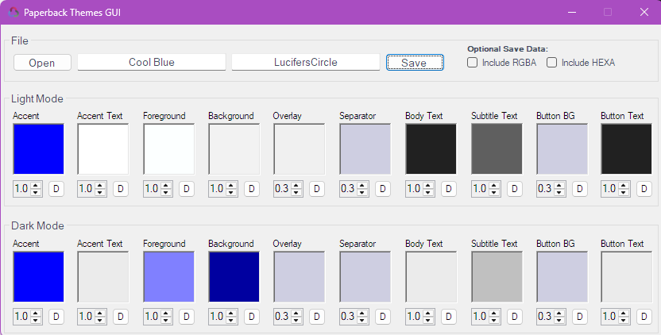

# Paperback Themes GUI
Theming GUI for the Paperback iOS app

Paperback:
 - [Website](https://paperback.moe/)
 - [Github](https://github.com/Paperback-iOS/app)
 - [Themes Github](https://github.com/Celarye/paperback-themes)

Paperback Themes GUI is a graphical user interface to help you visualize your Paperback theme files.
Created with inspiration from [Paperback Themes](https://github.com/Celarye/paperback-themes) and guidance from [Celarye](https://github.com/Celarye).

## Images



## Features
 - Open SRGB/RGBA/HEXA theme files
 - View/Edit theme colors and alpha values
 - Save theme files in SRGB/RGBA/HEXA

Manually editing your theme file may be required if you plan on submitting your theme to the official themes repository.

## Tech
Paperback Themes GUI uses these projects to work properly:

- [Newtonsoft.Json] - High-performance JSON framework for .NET
- [Visual Studio (2022)] - Comprehensive IDE for .NET and C++ developers on Windows.
- [.NET Framework 4.7.2] - Windows-only version of .NET for building client and server applications.

## Installation

You can grab the `pbtgui.exe` executable from the [latest release](https://github.com/LucifersCircle/paperback-themes-gui/releases/latest).
Double click "pbtgui.exe" to start the applicaton.

## Development

Want to contribute? Great!

[Pull requests](https://github.com/LucifersCircle/paperback-themes-gui/pulls) are always welcome!

## Building from source

1. Clone the repository

```bash
git clone https://github.com/LucifersCircle/paperback-themes-gui.git
```

- Opening and building the project using Visual Studio  
  2. In the project folder, double click `pbtgui.sln` to open the solution in the Visual Studio solution explorer.  
  3. Build the project with the run button.

- Opening and building the project using the command line  
  2. Change directory to the root of the project.  
  3. Run `msbuild /t:build /p:Configuration=Release src/pbtgui.sln`
  > Requires [MSBuild](https://learn.microsoft.com/en-us/visualstudio/msbuild/walkthrough-using-msbuild?view=vs-2022#install-msbuild)


## License

This project is licensed under the [GNU General Public License v3.0](https://www.gnu.org/licenses/gpl-3.0.txt).

[Newtonsoft.Json]: <https://github.com/JamesNK/Newtonsoft.Json>
[Visual Studio (2022)]: <https://visualstudio.microsoft.com/downloads/>
[.NET Framework 4.7.2]: <https://dotnet.microsoft.com/en-us/download/dotnet-framework/net472>